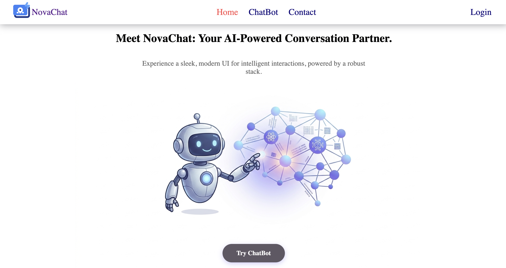
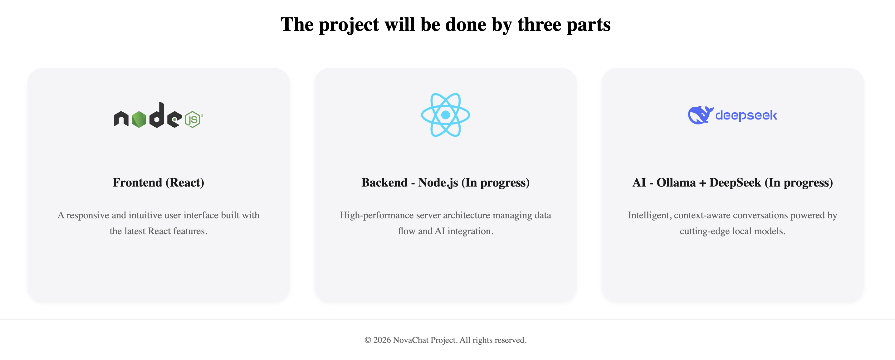
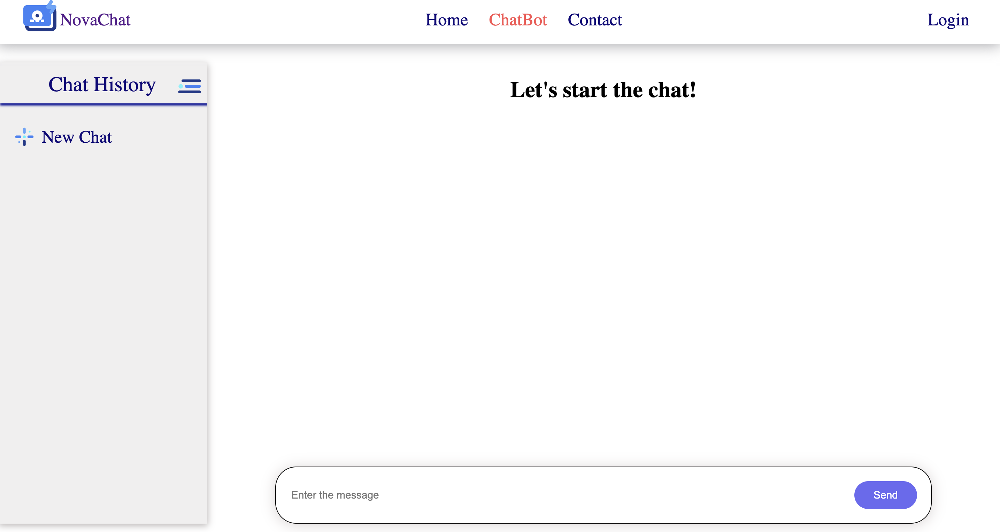
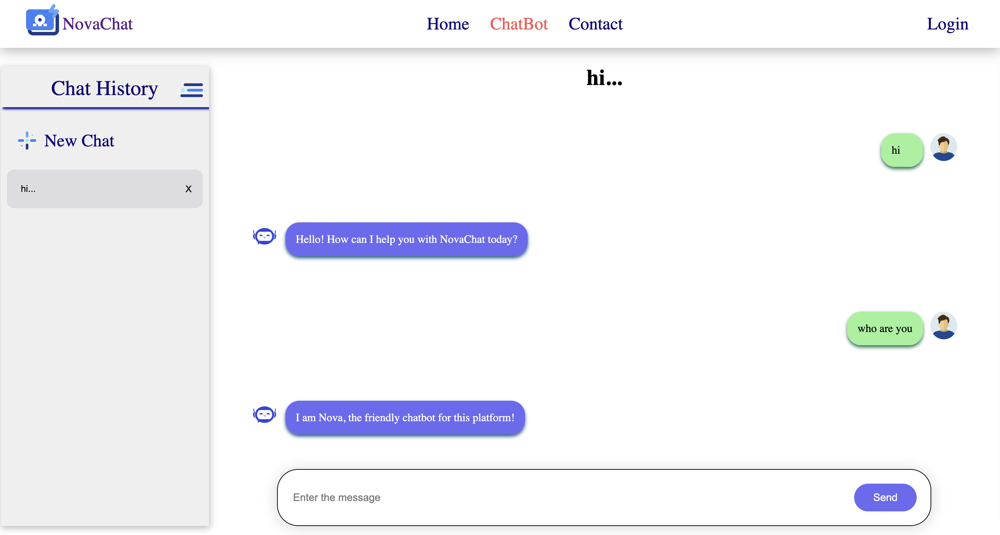
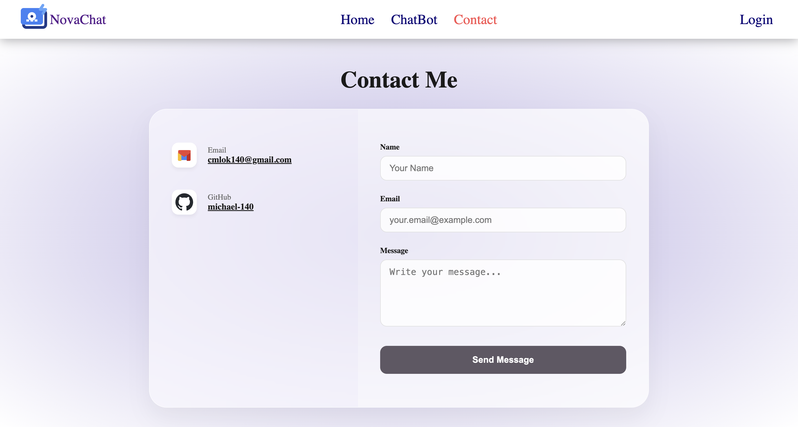
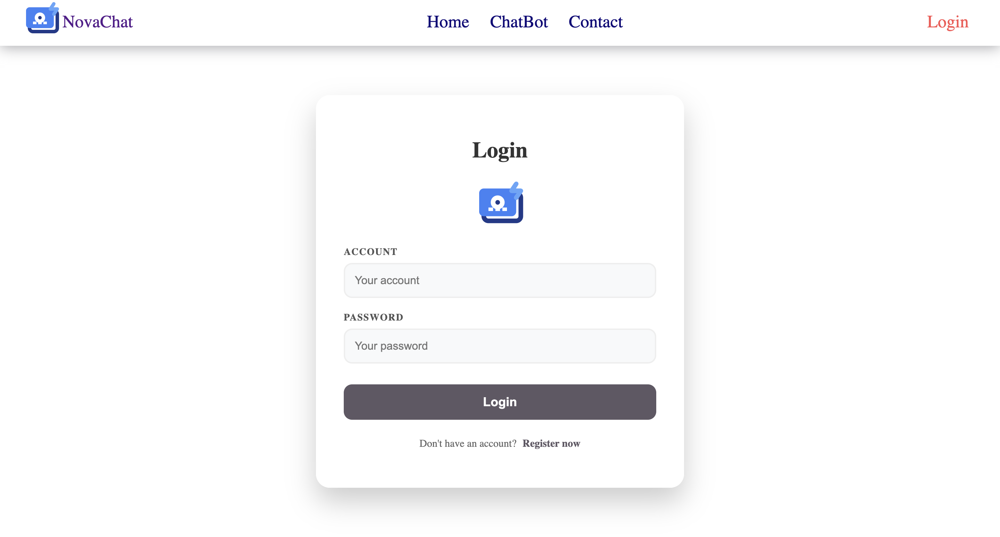

# NovaChat - AI chatbot
This is a practice project that deply a AI chatbot with an another UI style.

## We can divide this project into three main parts:
1. Frontend (React+vite)
    - Home 
    
    

    - ChatBot (key part in this project)
    
    

    - Contact
    

    - Login
    

    \* for more detail please check the [**NovaChatFrontend**](https://github.com/michael-140/NovaChat/tree/main/NovaChatFrontend) folder
2. Backend (Nodejs+Express) 
    - Authentication: Secure user system featuring password hashing (bcrypt) and HttpOnly Cookie session management.

    - Session Persistence: Integrated React Context API with a dedicated /api/reload endpoint to maintain user sessions across page refreshes.

    - Real-time Communication: Powered by Socket.io for instantaneous bidirectional messaging between the user and AI.

    - Data Persistence: File-based JSON storage for user profiles and encrypted chat histories.

    - Security: Implementation of CORS policies with credential support and protected API routes.

    \* For more details, please check the [**NovaChatBackend**](https://github.com/michael-140/NovaChat/tree/main/NovaChatBackend) folder.
3. AI (Ollama+deepseek-r1:8b) - In progress